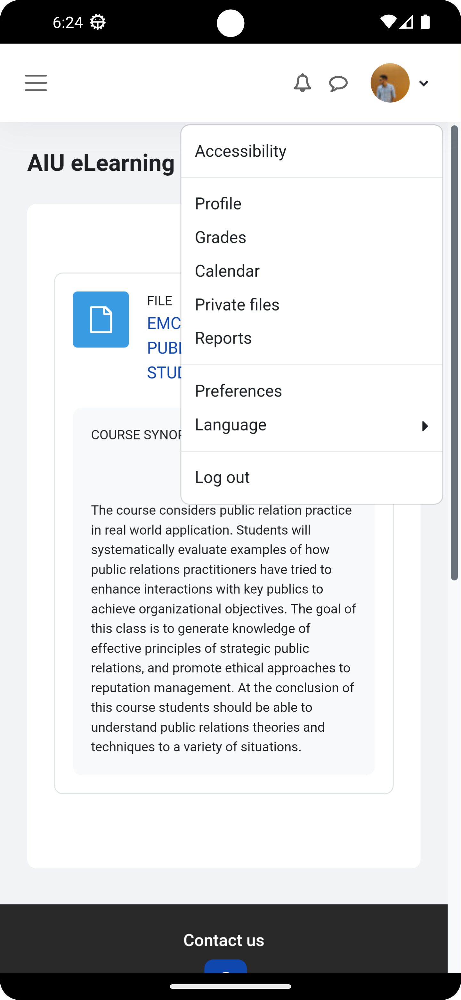
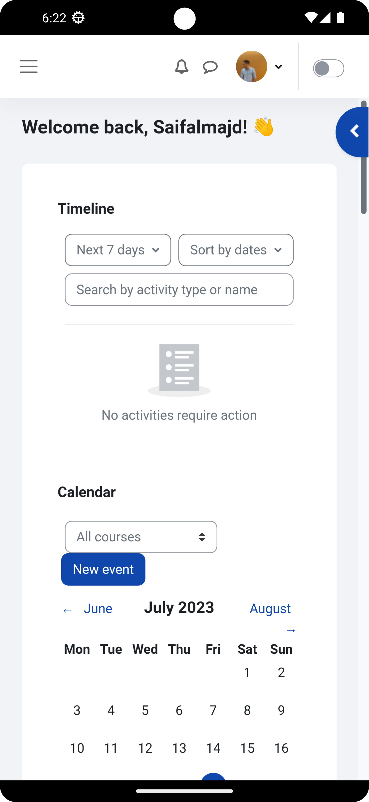
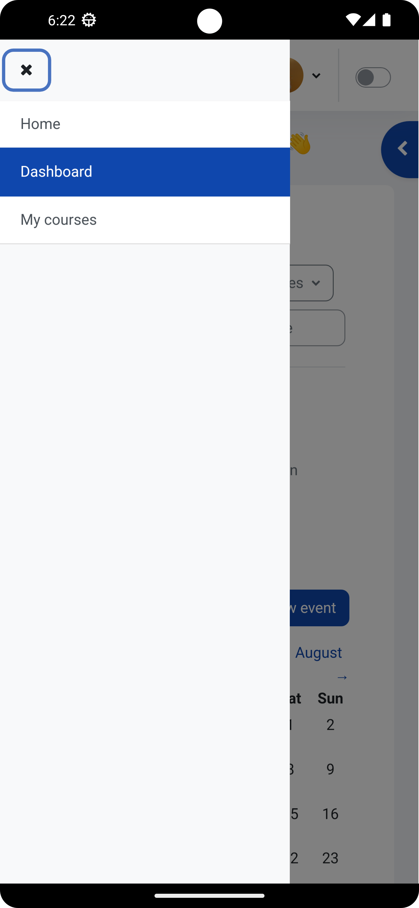
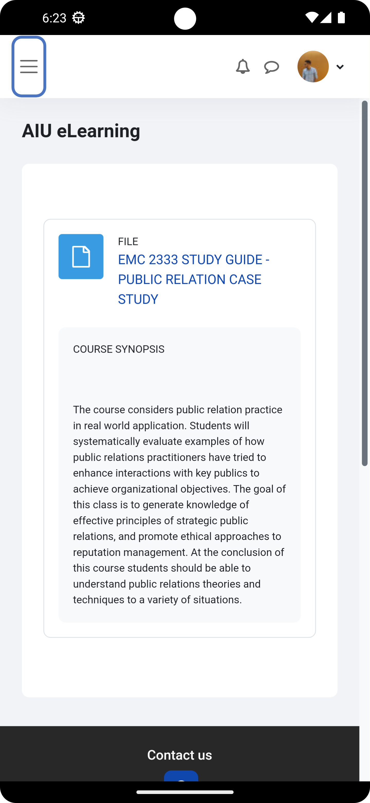
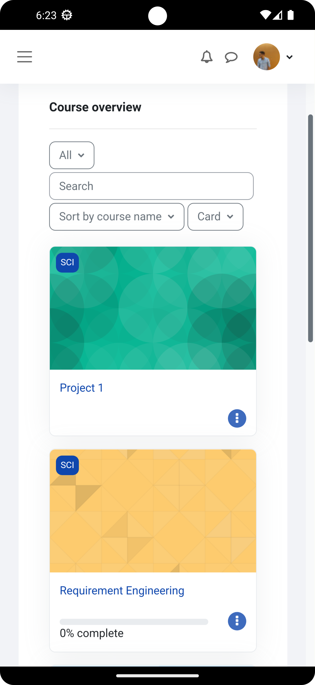
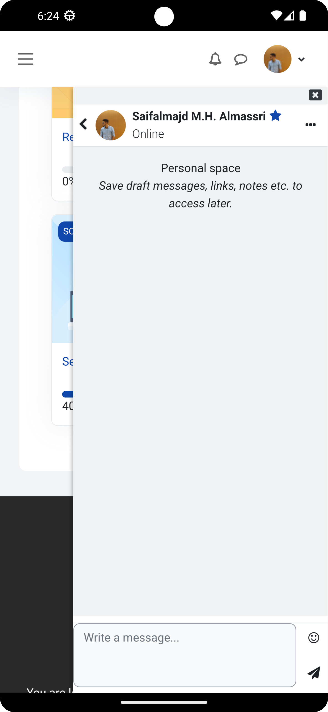

# AIU E_Learn Platform

## Overview

Welcome to the AIU E_Learn Platform! This Flutter-based application is a comprehensive e-learning solution designed to provide a seamless and interactive educational experience. Whether you are a student, instructor, or administrator, this app is tailored to meet your educational needs.

## Features
1. Courses
2. Learning Modules
3. Collaboration and Discussion
4. Assessment and Grading
5. Notifications and Announcements
6. User Profiles

## Getting Started

To get started with the AIU E_Learn Platform:

1. **Clone the Repository:**
   ```bash
   git clone https://github.com/Syf-Almjd/AIU_elearning.git
   ```

2. **Navigate to the Project Directory:**
   ```bash
   cd AIU_elearning
   ```

3. **Install Dependencies:**
   ```bash
   flutter pub get
   ```

4. **Run the App:**
   ```bash
   flutter run
   ```


## Screenshots

| Screenshot 1                              | Screenshot 2                              | Screenshot 3                              |
|-------------------------------------------|-------------------------------------------|-------------------------------------------|
|  |  |  |

| Screenshot 4                              | Screenshot 5                              | Screenshot 6                              |
|-------------------------------------------|-------------------------------------------|-------------------------------------------|
|  |  |  |


## Requirements

- Flutter 2.0.0 or later
- Dart 2.12.0 or later
- Internet connection for course content and updates

## Contributing

We encourage contributions to make the AIU E_Learn Platform even better. If you have suggestions or find issues, please open an issue or submit a pull request.

## License

This project is licensed under the [MIT License](https://opensource.org/license/mit/).

## Contact

For support or inquiries, please contact me at syfalmjd11@gmail.com.

Thank you for choosing the AIU E_Learn Platform. We hope it facilitates your learning journey!